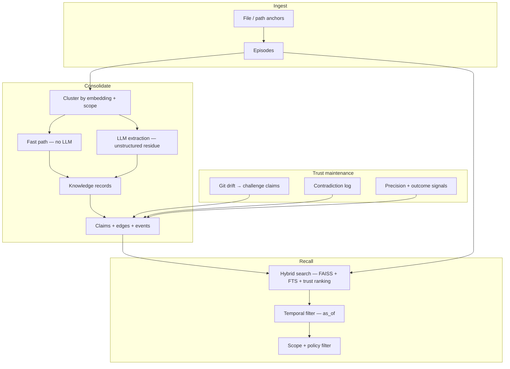

# consolidation-memory

[](https://pypi.org/project/consolidation-memory/)
[](https://github.com/charliee1w/consolidation-memory/releases)
[](https://github.com/charliee1w/consolidation-memory/actions)
[](https://pypi.org/project/consolidation-memory/)
[](LICENSE)

**Engineering knowledge layer for agents.**

Agent A explores 150 files to find a fix. Agent B explores the same 150
files. An agent-heavy team pays that research bill over and over.
consolidation-memory turns each investigation into **claims with
provenance** that *accumulate, get invalidated when the code moves, and get
verified* — so the next agent reads the answer instead of re-deriving it.

```bash
pip install "consolidation-memory[fastembed]"
consolidation-memory init     # one-time setup (no LLM needed)
consolidation-memory serve    # MCP server for your agent
```

- **Where it runs**: Cursor, Claude Code, Continue, any MCP host; or straight Python, REST, and OpenAI-style tool calls.
- **What you get**: hybrid recall with provenance, claims that survive chat history, git-aware staleness, per-project and cross-project scopes with ACL.
- **What you don't get**: a hosted black box, telemetry, or an LLM bill you didn't ask for (LLM is optional).

---

## Research should amortize

The default cost model of agent tooling:

```text
Agent A ─► explores 150 files ─► finds the fix ────────┐
Agent B ─► explores the same 150 files ─► same fix ────┼─ paid N times
Agent C ─► re-discovers the same architecture ─────────┘
```

The knowledge existed after Agent A. Nothing kept it — so it is bought
again. consolidation-memory closes that loop:

```text
   Agent exploration · Agent outcomes
              │
              ▼
        Evidence layer            (episodes, anchors, timestamps)
              │
              ▼
     Claims / knowledge           (typed records → durable claims + sources)
              │
   ┌──────────┼──────────┐
   ▼          ▼          ▼
 trust     validity    relations
 (decay)  (git drift,  (edges, topics,
           contradictions)  scopes)
```

- **Accumulate** — consolidation merges today's evidence into tomorrow's starting point.
- **Invalidate** — git drift and contradiction logs lower trust instead of hiding staleness.
- **Verify** — every recall ships with sources, `as_of` time and scope attribution.

The more agents (and people) share one store, the steeper the amortization:
research cost stops scaling linearly with headcount — and the effect is
largest exactly where research dominates: agent-heavy operations.

---

## What it is — and what it isn't

**consolidation-memory** is a durable knowledge layer for long-horizon
coding work. Agents write *episodes* (what happened); a consolidation step
turns them into typed *knowledge records* and hash-stable *claims* with
sources and lifecycle events; recall returns evidence you can audit on disk.

**It is:**

- a local SQLite + FAISS + markdown store you own and can read with `less`
- a trust system: provenance, contradictions, `as_of` time travel, drift challenges
- an LLM-optional pipeline — a deterministic fast path handles structured episodes
- four interchangeable surfaces (Python, MCP, REST, OpenAI tools) over one dispatch

**It is not:**

- a generic “remember everything” consumer assistant
- a replacement for git, issue trackers, or product docs
- opaque vector RAG over your chat log — no provenance, no staleness story
- a hosted service — nothing leaves your machine except the embedding/LLM
  backends **you** configure

Good fit / not-a-fit in more detail: [Who should use this](#who-should-use-this).

---

## One layer, many scopes

When several microservices are built **in parallel**, the expensive
knowledge is not inside one repo — it is *between* them: wire formats,
retry semantics, rollout order, breaking changes. Scopes keep each
service's internal work private while giving that boundary knowledge a
shared home:

```text
            ┌────────────── shared contract scope ──────────────┐
            │ event payloads · idempotency rules · rollout order │
            │ breaking-change warnings · integration how-tos     │
            └────────▲───────────────────────────▲───────────────┘
       publish / read │                           │ publish / read
┌─────────────────────┴────────────┐ ┌────────────┴──────────────────────┐
│ orders-service scope             │ │ payments-service scope            │
│ agents exploring orders keep:    │ │ agents exploring payments keep:   │
│ failure modes, migrations,       │ │ retry semantics deep-dives,       │
│ internal refactors, experiments  │ │ internal refactors, experiments   │
└──────────────────────────────────┘ └───────────────────────────────────┘
                 ▲                              ▲
                 └── ACL: who may read/write which scope ──
```

How a parallel setup uses it:

- **Each service's agents write to their own scope.** Work-in-progress
  findings, half-finished refactors and dead ends stay where they belong —
  they do not pollute a sibling service mid-sprint.
- **Boundary findings get published to the shared scope.** An agent that
  discovers an event-payload quirk or breaks a contract writes it there —
  the counterpart's agents read it without touching your internals.
- **ACL enforces need-to-know.** Bindings per principal (service, app,
  agent) decide who may read a scope and who may write to it: consumers of
  the contract see the shared scope, not each other's unfinished business.
- **Time works in your favor.** `as_of` shows how the contract evolved day
  by day while both sides moved; git drift retires claims pinned to code
  that has already been rewritten.

The payoff: an agent picking up either service — or a *new* service joining
the contract — starts from the shared scope instead of re-reading two
codebases. Knowledge has a **place**, an **audience** and a **permission
trail**, not just a similarity score: that is the difference between an
engineering knowledge layer and memory.

Mechanics, principals and grant recipes: [Access control](docs/ACL.md) ·
[Scopes in the MCP guide](docs/MCP_GUIDE.md#scopes-and-sharing).

---

## How it works

> Claims are the reusable unit; episodes are the raw evidence behind them.

```text
  Episode                 Evidence from a session (chat, tool output, structured JSON)
      │
      ▼ consolidation
  Knowledge record        Typed fact · solution · preference · procedure · strategy
      │
      ▼ deterministic materialization
  Claim                   Reusable belief + sources + lifecycle events
      │
      ▼ human-readable view
  Topic                   Markdown file + DB rows you can open and audit
```



Contradictions, challenges and expiry stay visible — the system never
silently overwrites an uncertain belief. Deep dive: [Architecture](docs/ARCHITECTURE.md).

---

## What it does

| Capability | What you can do | Why it matters |
| --- | --- | --- |
| **Hybrid recall** | Semantic (FAISS) + keyword (FTS5) + metadata ranking over episodes, topics, records, claims | Answers with uncertainty, contradictions and scope attribution — not just a top-k blob |
| **Fast-path consolidation** | Structured episodes ([shapes](docs/FAST_PATH_EPISODES.md)) consolidate **without an LLM** | Predictable cost; works with `llm.backend = "disabled"` |
| **Drift-aware trust** | `detect_drift` maps git changes → file anchors → impacted claims → audit events | Last month's fix stops pretending to be true after the refactor |
| **Temporal queries** | `as_of` on recall and claim search | “What did we believe *before* the rollback?” |
| **Scoped sharing** | Per-project *and* cross-project scopes; ACL principals grant read/write per audience | Knowledge lives where it belongs; integration knowledge flows without leaking internals — see [ACL](docs/ACL.md) |
| **Adaptive scheduling** | Utility scheduler weighs backlog, recall misses, contradictions, failed outcomes | `memory_status` exposes `trust_profile`, `utility_scheduler.run_decision.explanation`, `fast_path_hits`, `llm_fallbacks` — automation stays inspectable |
| **Surface parity** | Same dispatch behind Python, MCP, REST, OpenAI tools | No “MCP-only” behavior drift between your tools |

---

## How it compares

Two columns: the generic pattern, and projects you may already know. Rows are
design choices, not scorecards — follow the links and judge.

| Question | Typical vector RAG / chat memory | consolidation-memory | Named alternatives |
| --- | --- | --- | --- |
| What is stored? | Embeddings of chunks/snippets | Episodes → typed records → **claims** with sources, plus readable markdown topics | [mem0](https://github.com/mem0ai/mem0): facts/memories; [graphiti](https://github.com/getzep/graphiti): temporal graph; [Letta](https://github.com/letta-ai/letta): agent state blocks; [Zep](https://github.com/getzep/zep): temporal graph service |
| Can you audit *why* something is remembered? | Usually no | Every claim carries provenance + lifecycle events on disk | Graph-based tools store edges; chat-RAG generally does not |
| Does staleness get handled? | No — old chunks stay equally “true” | **Drift challenge**: git changes reduce claim precision, auditable events | Refresh policies exist elsewhere; git-anchored challenge is our differentiator |
| Isolation between projects/agents | Usually org-level or none | **Scopes per project/service + ACL principals** (need-to-know) | Typically account/org boundaries; fine-grained per-scope ACL is rare |
| Time travel | Rare | `as_of` on recall and claim search | graphiti/Zep offer temporal queries too |
| LLM cost of consolidation | Often LLM-per-write or hosted extraction | Fast path for structured episodes; LLM only for the residue | Varies; several products default to hosted LLM extraction |
| Where it runs | Your laptop, a server, or a vendor cloud | **Local disk by default**, no account, no telemetry; self-host everything | mem0/Letta self-hostable; Zep has hosted and community options |
| Tool surfaces | Library + one API, usually | Python · MCP · REST · OpenAI tools — parity by tests | Typically SDK + REST; MCP support varies |

Numbers behind our claims: [LoCoMo benchmark](docs/LOCOMO_BENCHMARK.md) ·
[real-world metrics](docs/REAL_WORLD_METRICS.md).

---

## Install and try it

```bash
pip install "consolidation-memory[fastembed]"
consolidation-memory init      # guided setup; picks local embeddings
consolidation-memory test       # end-to-end smoke of your install
```

During `init`, choose **`disabled`** for the LLM backend unless you already
run LM Studio, Ollama or OpenAI — storage, hybrid recall, drift detection
and MCP serving all work without it.

**Your first memory in 30 seconds:**

```python
from consolidation_memory import MemoryClient

with MemoryClient(auto_consolidate=False) as mem:
    mem.store(
        "Fix: rerun pytest with -p no:randomly when the fixture order flakes",
        content_type="solution",
        tags=["pytest", "ci"],
    )
    print(mem.recall("pytest fixture order flake").episodes[0].content)
```

Then wire it into your agent: [Connect your agent (MCP)](#connect-your-agent-mcp).

**Optional extras**

| Extra | Enables |
| --- | --- |
| `[fastembed]` | Local embeddings (recommended default) |
| `[openai]` | Hosted OpenAI embeddings / LLM |
| `[rest]` | REST API + browser UI |
| `[dashboard]` | Textual TUI inspector |
| `[desktop]` | Native desktop app with tray icon |
| `[all,dev]` | Full stack + test/lint tooling |

Backend matrix: [Model support](docs/MODEL_SUPPORT.md) · Runnable wiring: [examples/](examples/README.md)

---

## Connect your agent (MCP)

Full walkthrough — result contract, scopes, errors, environment, recipes:
**[docs/MCP_GUIDE.md](docs/MCP_GUIDE.md)** · Generated tool reference (all 29 tools):
**[docs/TOOLS.md](docs/TOOLS.md)**.

Use an **absolute Python path** — more reliable than a console script, especially on Windows:

```json
{
  "mcpServers": {
    "consolidation_memory": {
      "command": "/absolute/path/to/python",
      "args": ["-m", "consolidation_memory", "--project", "default", "serve"],
      "env": {
        "PYTHONUNBUFFERED": "1",
        "CONSOLIDATION_MEMORY_IDLE_TIMEOUT_SECONDS": "900",
        "CONSOLIDATION_MEMORY_STATUS_LIGHTWEIGHT": "1",
        "CONSOLIDATION_MEMORY_MCP_AUTO_CONSOLIDATE": "0",
        "CONSOLIDATION_MEMORY_PRELOAD_SCIPY_ON_START": "1",
        "CONSOLIDATION_MEMORY_DEFERRED_KNOWLEDGE_RETRY_SECONDS": "0"
      }
    }
  }
}
```

`consolidation-memory init` prints the full recommended env (timeouts,
warmup, lightweight status). Drop-in configs: [Cursor](examples/cursor-integration/README.md)
· [Continue](examples/continue-dev/README.md).

**Simple profile** (3 of **29** full-profile tools): add
`"CONSOLIDATION_MEMORY_MCP_TOOL_PROFILE": "simple"` — exposes
`memory_recall`, `memory_remember`, `memory_ask` only.

**Result contract.** Every tool returns its payload as an object in
`structuredContent` plus the same JSON as UTF-8 text in `content` (no
`\uXXXX` escapes). The published `outputSchema` describes it; failures
surface as `isError: true` with actionable text; unknown input arguments
are rejected. Representative tools:

| Tool | Purpose |
| --- | --- |
| `memory_store` / `memory_remember` | Persist episodes with type, tags, scope |
| `memory_recall` / `memory_ask` | Hybrid recall; plain-language questions |
| `memory_search` | Plain-text search (non-semantic) |
| `memory_claim_search` / `memory_claim_browse` | Claim-centric retrieval |
| `memory_detect_drift` | Git-based claim challenge |
| `memory_consolidate` / `memory_status` | On-demand runs; health & scheduler truth |
| `memory_scope_list` | Discover existing scopes (pageable) |
| … full list | [docs/TOOLS.md](docs/TOOLS.md) |

### REST API

```bash
consolidation-memory serve --rest     # HTTP API on the [rest] extra
consolidation-memory ui               # same server + browser UI at /ui/
```

Same 29 tools over HTTP, with the same contract: every request body rejects
unknown keys with **422** (the schemas promise `additionalProperties: false`).
`GET /memory/scopes` is the scope-discovery route behind `memory_scope_list`
(pageable via `limit`/`offset`). Beyond loopback, requests need
`CONSOLIDATION_MEMORY_REST_AUTH_TOKEN`; a non-loopback bind without one is
refused. See the [security policy](SECURITY.md).

### Graphical interfaces

```bash
consolidation-memory ui          # browser: Ask · Remember · Browse · Health · Hygiene · Metrics
consolidation-memory dashboard   # terminal TUI inspector
consolidation-memory app         # native window + system tray
```

Details, tabs, data paths and trust rules: **[docs/UI.md](docs/UI.md)**.

---

## Configuration

| You want to… | Do this |
| --- | --- |
| Change backends | `llm.backend` / embedding settings — matrix in [Model support](docs/MODEL_SUPPORT.md) |
| Tune timeouts, warmup, profiles, paths | Full `CONSOLIDATION_MEMORY_*` reference in [MCP guide — environment](docs/MCP_GUIDE.md#environment-reference) (or run `consolidation-memory init` and read what it prints) |
| Pick a project | `--project <name>` or `CONSOLIDATION_MEMORY_PROJECT` |
| Run without an LLM | `llm.backend = "disabled"` + fast-path [episode shapes](docs/FAST_PATH_EPISODES.md) |
| Automate maintenance | `consolidation-memory daemon install` (utility scheduler) |
| Manage sharing rules | [ACL guide](docs/ACL.md) — CLI, REST and agent-driven policy grants |

---

## Managing your data

- **Where it lives**: `platformdirs.user_data_dir("consolidation_memory")/projects/<project>/`
  (override: `CONSOLIDATION_MEMORY_DATA_DIR`). Plain SQLite files, FAISS
  index and markdown topics — back them up with your normal file tools.
- **Export / import**: `consolidation-memory export` → JSON snapshot;
  `consolidation-memory import PATH` restores it elsewhere.
- **Prune noise**: `consolidation-memory hygiene scan` → `hygiene apply`
  (or the Hygiene tab in the UI) removes noisy episodes and repairs orphaned
  claims. `memory_forget` expires an episode **and** claims that lose all
  provenance.
- **Privacy**: no telemetry; network I/O only to the embedding/LLM backends
  you configured; REST refuses non-loopback binds without a token.

---

## Who should use this

**Good fit**

- Developers using Cursor, Claude Code, Continue or custom agents on real repositories
- Teams needing durable agent knowledge with explicit scope boundaries
- Agent-heavy operations where every extra agent currently re-buys the same research
- Workflows where file changes should reduce trust in prior conclusions
- Builders who want inspectable on-disk artifacts, not a hosted black box

**Not a fit**

- Generic consumer “remember everything” assistants
- Replacing git, issue trackers or canonical product docs
- Opaque vector RAG with no provenance story

---

## Documentation

**For users and operators**

| Doc | Why read it |
| --- | --- |
| [MCP guide](docs/MCP_GUIDE.md) | Wire contract, scopes, errors, environment, recipes |
| [Tool reference](docs/TOOLS.md) | Generated schemas for every tool |
| [Access control](docs/ACL.md) | Policies, ACL bindings, principals, multi-service pattern |
| [Graphical interfaces](docs/UI.md) | Browser UI, TUI dashboard, desktop app |
| [Architecture](docs/ARCHITECTURE.md) | Modules, persistence, data flow |
| [Fast-path episodes](docs/FAST_PATH_EPISODES.md) | LLM-free consolidation shapes |
| [Model support](docs/MODEL_SUPPORT.md) | Embedding and LLM backends |
| [Examples](examples/README.md) | Cursor, REST, LangGraph, plugins |
| [Trust vs RAG](examples/trust-vs-rag/README.md) | Same bug twice — recall + drift demo |
| [LoCoMo benchmark](docs/LOCOMO_BENCHMARK.md) · [Real-world metrics](docs/REAL_WORLD_METRICS.md) | Quality evidence |

**For contributors**

[CONTRIBUTING.md](CONTRIBUTING.md) · [Roadmap](docs/ROADMAP.md) ·
[Plugin development](docs/PLUGIN_DEVELOPMENT.md) ·
[Release gates](docs/RELEASE_GATES.md) · [Release automation](docs/RELEASE_AUTOMATION.md) ·
[Changelog](CHANGELOG.md) · eval guides: [NOVELTY_EVAL_GUIDE](docs/NOVELTY_EVAL_GUIDE.md),
[NOVELTY_METRICS](docs/NOVELTY_METRICS.md), [NOVELTY_WEDGE](docs/NOVELTY_WEDGE.md),
[CODING_AGENT_METRICS](docs/CODING_AGENT_METRICS.md)

---

## Community

- [Issues](https://github.com/charliee1w/consolidation-memory/issues)
- [Discussions](https://github.com/charliee1w/consolidation-memory/discussions)
- [Releases](https://github.com/charliee1w/consolidation-memory/releases) · [Changelog](CHANGELOG.md)
- [Security policy](https://github.com/charliee1w/consolidation-memory/security/policy)

MIT · [Code of Conduct](CODE_OF_CONDUCT.md) · [Contributors](CONTRIBUTORS.md)
