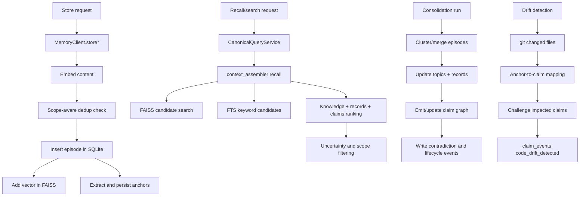

# Architecture

This document describes the current architecture of `consolidation-memory` as implemented in `src/consolidation_memory/`.

## Design Goals

- Local-first persistence with inspectable on-disk artifacts.
- Trust-preserving retrieval (temporal validity, provenance, contradiction visibility, drift challenge events).
- Single semantic contract across MCP, REST, Python, and OpenAI-compatible tools.
- Backward compatibility for single-project usage while supporting explicit shared scopes.
- Amortize agent research: one investigation accumulates into shared, decaying, verified knowledge instead of being re-bought per session.

## Product Stance

`consolidation-memory` is designed as a trust layer for coding-agent memory.

- Claims are the reusable unit.
- Episodes are the raw evidence behind those claims.
- Reuse should degrade when provenance is weak, contradictions accumulate, or code drift challenges prior conclusions.
- Shared memory is only valuable when scope and policy make reuse safe.
- Knowledge is an engineering layer: it accumulates, gets invalidated, and gets verified — not a flat pool of embeddings.

## Runtime Surfaces

- CLI entrypoint: `cli.py`
- MCP server: `server.py`
- MCP output contracts (published `outputSchema`): `tool_contracts.py`
- Private `mcp` SDK seam (schema publication, strict tool arguments): `mcp_compat.py`
- REST API: `rest.py` (+ `ops_routes.py` for `/ops/*` maintenance routes)
- Python API: `client.py`
- Package version: `__init__.__version__`, read from the installed distribution
  metadata and falling back to the `0.0.0` sentinel when that metadata is
  unavailable (an uninstalled source checkout, or a subprocess whose interpreter
  cannot see the dist-info). Only `PackageNotFoundError` is tolerated; any other
  lookup failure propagates.
- OpenAI tool schemas/dispatch: `schemas.py`
- Browser UI: `web_ui.py` + `web/` (served at `/ui/` by the REST app)
- TUI dashboard: `dashboard.py` + `dashboard_data.py` (direct SQLite reads)
- Desktop app: `desktop_app.py` + `desktop_backend.py` (system tray; shared dispatch)

All surfaces route to `MemoryClient` and canonical query semantics in `query_service.py`.

### Input and output contracts

Both contracts come from one place each and are enforced at runtime. The
per-surface enforcement points and wire shapes belong to
[MCP_GUIDE.md](MCP_GUIDE.md) and [SECURITY.md](../SECURITY.md); what matters
architecturally:

- **One derivation.** `tool_dispatch.accepted_argument_names` reads the
  published `schemas.openai_tools` `inputSchema` (which declares
  `additionalProperties: false`) and yields the allowed argument set per tool.
  The dispatch guard, the REST models and the SDK check all consume that set,
  so there is no second list to fork. `server._verify_published_argument_contract()`
  compares the SDK-enforced set against the dispatch set at import and in
  `lifespan`.
- **One contract per tool.** `tool_contracts.py` holds a typed success arm per
  tool, published as `anyOf[success, error]`; 29 tools share 28 contracts
  (`memory_store` and `memory_remember` publish the same `StoreOutput`).
  Successful payloads are validated before leaving the process; execution
  failures surface as `isError: true` with actionable text, and text and
  `structuredContent` carry the same UTF-8 JSON.
- **Producer types mirror contracts.** `types.HygieneApplyResult` is the
  producer-side dataclass for `memory_hygiene_apply`;
  `_assert_mirrors_result_type` runs at import and breaks the process if a
  field name, annotation or required-ness diverges from the published
  contract, so a contract can never reject a payload after the tool already
  applied its side effects.

### MCP SDK compatibility seam

The SDK exposes both contracts only through private, unversioned surfaces.
`mcp_compat.py` is the **only** module allowed to touch them
(`ArgModelBase`, `MCPServer._tool_manager`, `ToolManager._tools`,
`Tool.fn_metadata.output_schema` and the `Tool.__dict__["output_schema"]`
cached-property entry). A missing module or attribute raises
`MCPCompatError` naming the installed `mcp` version, the supported range
(`mcp[cli]>=2.3.0,<3`) and what was probed, instead of degrading silently.

`outputSchema` publication is self-healing: `install_list_tools_heal` wraps the
public `MCPServer.list_tools` — the single `tools/list` funnel — so a tool
registered after startup is repaired on the next listing instead of
publishing success-only forever. `server._verify_published_output_schemas()`
runs at import and in `lifespan` and fails loudly on a success-only schema.

## Core Module Map

Orchestration and surfaces:

- `__init__.py`: the package's public API — 46 names in a lazy export table
  (`_LAZY_IMPORTS`) resolved through `__getattr__`, `MemoryClient` plus 45
  enums, result and scope types from `types.py`, so a bare
  `import consolidation_memory` loads neither faiss nor numpy.
- `client.py`: orchestration, lifecycle, tool-facing operations, scope resolution.
- `client_runtime.py`: consolidation scheduler and backend health runtime helpers.
- `config.py`: `Config` dataclass, TOML/env loading, derived paths, validation.
- `runtime.py`: `MemoryClient` lifecycle owner and blocking-execution pool.
- `circuit_breaker.py`: CLOSED/OPEN/HALF_OPEN guard so a downed backend fails
  fast instead of re-paying its timeout on every call.
- `tool_dispatch.py`: canonical tool dispatch shared by MCP, REST and OpenAI
  surfaces, and the one source of truth for allowed tool arguments
  (`accepted_argument_names`, `reject_unknown_arguments`).
- `tool_contracts.py`: typed MCP output contracts (published `outputSchema`).
- `mcp_compat.py`: the only module touching private `mcp` internals; publishes
  and self-heals `outputSchema`, fails loudly on a missing/renamed surface.
- `types.py`: shared enums, payload dataclasses and result types
  (`ContentType`, `RecordType`, `HygieneApplyResult`).
- `query_service.py`: canonical query envelopes and service layer.
- `query_semantics.py`: shared trust filters (payload parse + scope filtering).
- `context_assembler.py`: hybrid recall across episodes/topics/records/claims.
- `tool_adapter.py`: shared recall deadline and keyword-fallback helpers.
- `recall_budget.py`: lets embedding backends and cache warmers yield early when
  a recall deadline is active.
- `simple_api.py`: `remember` / `ask` aliases over store/recall.

Knowledge and trust:

- `claim_graph.py`: deterministic claim canonicalization.
- `anchors.py`: anchor extraction from episode content.
- `entity_recall.py`: entity→anchor resolution for entity-boosted recall.
- `hypothesis_competition.py`: keeping contradicted records during consolidation.
- `drift.py`, `drift_subprocess.py`, `drift_worker.py`: git-based drift detection
  and claim challenge flow (out-of-process worker plus its interpreter launcher).
- `knowledge_consistency.py`, `markdown_records.py`, `knowledge_paths.py`:
  markdown/DB drift auditing, markdown-to-record parsing, topic path guards.
- `corpus_hygiene.py`: noisy-episode classification, orphan-claim repair, apply.
- `policy_engine.py`, `policy_admin.py`: scope/policy resolution (principal tokens,
  deny-overrides, visibility ranking) and the admin write path.

Storage and retrieval:

- `vector_store.py`: FAISS wrapper, tombstones, compaction, reload signaling.
- `embedding_disk_cache.py`: cross-process on-disk embedding cache.
- `episode_embedding.py`: embedding text shaping plus solution shape warnings.
- `claim_cache.py`, `record_cache.py`, `topic_cache.py`: invalidated after
  graph or knowledge mutations.
- `process_write_lock.py`: `ProcessWriteLease`, the cross-process single-writer lock.
- `database.py`: backward-compatible facade; re-exports the `db/` persistence API.
- `db/`: SQLite schema/migrations and domain CRUD (`connection`, `migrations`,
  `scope`, `episodes`, `anchors`, `topics`, `records`, `claims`, `consolidation`,
  `outcomes`, `export`, `stats`).
- `db/scope.py`: scope resolution, exact-match filters over the 11 canonical
  scope keys, and scope discovery (`list_scope_usage`).
- `backends/`: embedding and LLM backends (`base`, `fastembed_backend`,
  `lmstudio`, `ollama`, `openai_backend`).

Operations and integration:

- `maintenance.py`, `daemon_service.py`, `setup_service.py`, `release_gates.py`,
  `plugins.py`: the utility-scheduler daemon, first-run setup, release gate
  evaluation, and hook-based extension points.
- `consolidation/`: `engine`, `clustering`, `scoring`, `utility_scheduler`,
  `fast_path`, `prompting`.
- GUI group: `web_ui.py`, `web/`, `ui_ops.py`, `ops_routes.py`, `dashboard.py`,
  `dashboard_data.py`, `desktop_app.py`, `desktop_backend.py`.

## Data Flow



## Persistence Model

Persistence lives under `src/consolidation_memory/db/`, split by domain. `database.py` re-exports the public API (schema version, connections, scope filters, and CRUD), so the pre-split import paths stay valid.

`db/migrations.py` owns `CURRENT_SCHEMA_VERSION = 20` and `ensure_schema()` — the single schema entry point.

Primary tables:

- `episodes`
- `knowledge_topics`
- `knowledge_records`
- `access_policies`
- `policy_principals`
- `policy_acl_entries`
- `claims`
- `claim_sources`
- `claim_edges`
- `claim_events`
- `episode_anchors`
- `action_outcomes`
- `action_outcome_sources`
- `action_outcome_refs`
- `contradiction_log`
- `consolidation_runs`
- `consolidation_metrics`
- `consolidation_scheduler`
- `tag_cooccurrence`
- `episodes_fts` (FTS5 virtual table)
- `schema_version`

Key points:

- Records and claims carry `valid_from` / `valid_until`; claims also accumulate
  lifecycle rows in `claim_events`.
- Scope columns are persisted on episodes/topics/records for namespace/project/app/agent/session partitioning.
- Policy/ACL entities are first-class persisted rows:
  - `access_policies` define scope selectors (nullable fields behave as wildcards).
  - `policy_principals` define reusable principal identities.
  - `policy_acl_entries` bind principals to policy scopes with `write_mode` and/or `read_visibility`.
- FTS tables support keyword recall fallback and hybrid scoring.
- Scope discovery (`memory_scope_list` → `db.list_scope_usage`) has no scope
  table to read: it groups the flattened scope columns of `episodes`,
  `knowledge_records` and `knowledge_topics` on the 11 canonical exact-match
  keys, so a discovered scope is exactly as narrow as every other tool's scope
  filter, and the returned envelope is reusable as a `scope` argument. Counts
  and display metadata are derived with `MAX()` over the group; the read path
  never runs DDL. Counting rules and the trust boundary live in
  [MCP_GUIDE.md](MCP_GUIDE.md#discovering-existing-scopes) and
  [ACL.md](ACL.md#trust-boundary).

## Retrieval Semantics

`context_assembler.recall()` combines:

- Semantic candidates from FAISS.
- Keyword candidates from FTS5 when enabled.
- Priority scoring using similarity + metadata signals.
- Knowledge topic search and typed record search.
- Claim search with temporal and scope filtering.
- Optional uncertainty signals (low confidence, recently contradicted).

The retrieval bias is deliberate: prefer reusable claims with provenance and uncertainty signals, while keeping episodes available as raw supporting evidence.

`query_service.py` wraps this behavior into canonical envelopes (`RecallQuery`, `EpisodeSearchQuery`, `ClaimBrowseQuery`, `ClaimSearchQuery`, `OutcomeBrowseQuery`, `DriftQuery`) so all external adapters use the same semantics.

## Vector Store Behavior

`vector_store.py` guarantees:

- Thread-safe operations via a lock.
- Cross-process single-writer FAISS mutations via `.faiss_write.lock` lease.
- Atomic persistence (`os.replace`) for index/id-map/tombstones.
- Tombstone-based deletions + compaction rebuild.
- Reload signaling (`.faiss_reload`) for multi-process consistency.
- Optional flat-to-IVF upgrade when index size crosses configured threshold.

## Consistency Guardrails

Knowledge data has dual persistence surfaces (markdown files + structured DB rows).
`knowledge_consistency.build_knowledge_consistency_report()` compares them per
topic and reports `consistency_ratio` plus `meets_threshold`, where the
threshold is `KNOWLEDGE_CONSISTENCY_THRESHOLD` (default `0.995`).
`MemoryClient.status()` returns that report under `knowledge_consistency`
(zeroed under `lightweight=true`, which skips the markdown scan) and returns
`trust_profile` details for claim coverage, provenance coverage, anchor
coverage, contradiction pressure, and drift-watch posture.

## Scaling Envelope

FAISS behavior is tuned for local-first deployment:

- Default IVF upgrade threshold: `FAISS_IVF_UPGRADE_THRESHOLD = 10_000`.
- Platform review threshold: `FAISS_PLATFORM_REVIEW_THRESHOLD = 100_000`.
- `MemoryClient.status()` returns `scaling` advisories and index type.

When vector count crosses the platform review threshold, status/health report that a
larger-scale concurrency/indexing pass is due.

## Consolidation and Scheduler

`MemoryClient` runs consolidation manually or via background scheduling.

Before LLM extraction, each cluster tries **fast-path** deterministic parsers (`consolidation/fast_path.py`). Eligible episode shapes (structured JSON, preferences, procedures, path-anchored solutions) are documented in [FAST_PATH_EPISODES.md](FAST_PATH_EPISODES.md).

Important controls (from `config.py`):

- `CONSOLIDATION_AUTO_RUN`
- `CONSOLIDATION_FAST_PATH_ENABLED`
- `CONSOLIDATION_INTERVAL_HOURS`
- `CONSOLIDATION_MAX_DURATION`
- `CONSOLIDATION_UTILITY_THRESHOLD`
- `CONSOLIDATION_UTILITY_WEIGHTS`

Scheduler state is persisted in `consolidation_scheduler` to support deterministic lease/trigger behavior, including `last_trigger`, `last_utility_score`, and `last_trigger_breakdown` (utility snapshot at run start for `memory_status` explanations).

## Trust and Safety Controls

- Prompt-safety sanitization before LLM extraction/merge prompts.
- Structured output validation for extracted records.
- Temporal querying (`as_of`) for records and claims.
- Explicit contradiction tracking in `contradiction_log` and claim events.
- Drift challenge workflow that writes auditable `code_drift_detected` events.
- Path traversal guards for topic read operations.

## Scope and Compatibility

Omitting `scope` yields the active project's default scope, so single-project
usage needs no scope vocabulary. Supplying a `scope` adds canonical scope
metadata on writes and a scope filter on reads. Shared namespace modes can
widen visibility deliberately while private defaults stay available.

Full guide with grant recipes and a multi-service pattern: [ACL.md](ACL.md).

Policy precedence and conflict semantics:

- `scope.policy` is the inline form, for a single call without a persisted row.
- Persisted ACL entries are authoritative when present for the resolved scope/principal.
- Write conflicts use deny-overrides-allow (`deny` wins).
- Read visibility conflicts resolve to the most restrictive level (`private` < `project` < `namespace`).

## How To Verify This Document

```bash
python -m consolidation_memory --help
python -m consolidation_memory serve --help
python - <<'PY'
from consolidation_memory import __version__
from consolidation_memory.database import CURRENT_SCHEMA_VERSION
print(__version__, CURRENT_SCHEMA_VERSION)
PY
```

The module map above is the reading order; `tests/test_architecture_doc_sync.py`
fails when the schema version or the claim/outcome/scheduler table names drift.
